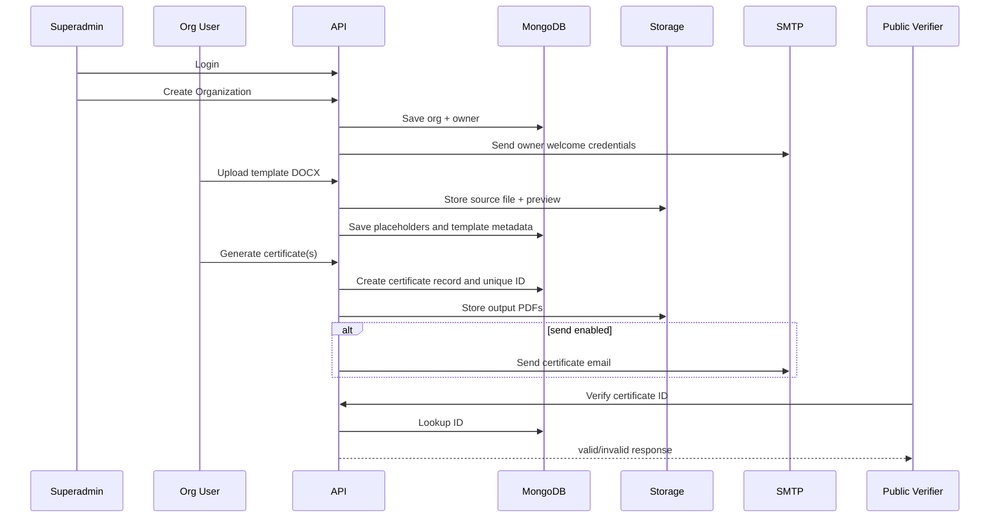

# APP_FLOW

Source alignment:
- `FEATURE_OVERVIEW_SOURCE.md` user flows
- `DEVELOPER_REQUIREMENTS_SOURCE.md` detailed process notes

## 1) Superadmin Organization Provisioning Flow
1. Superadmin login.
2. Open organizations page.
3. Create organization with owner info.
4. System creates organization and owner user.
5. Owner receives welcome email with credentials.

## 2) Owner First Certificate Flow
1. Owner logs in and changes password.
2. Owner uploads template in `/organization/templates`.
3. Placeholders are extracted and preview generated.
4. Owner navigates to `/organization/certificates`.
5. Owner selects template and fills values.
6. Certificate PDF generated.
7. Owner downloads or sends via SMTP.

## 3) Bulk Generation Flow
1. Select template.
2. Upload CSV/Excel.
3. Map columns to placeholders.
4. Preview data.
5. Generate all certificates.
6. Download ZIP.
7. Optional batch email send.

## 4) Public Verification Flow
1. Recipient scans QR or opens verify page.
2. Manual ID can be entered.
3. System checks certificate by unique ID.
4. Valid certificate details are shown.
5. Invalid certificate returns not found message.

## 5) System Event Flow
- User auth events logged.
- Template operations logged.
- Certificate operations logged.
- Profile/password events logged.
- Superadmin and org activity views query these logs.

## 6) Navigation Structure
Superadmin:
- Overview
- Organizations
- Admin Activity
- Logout

Organization:
- Dashboard
- Profile
- Templates
- Certificates
- Roles and Users
- Activity
- Logout

## 7) Sequence View

